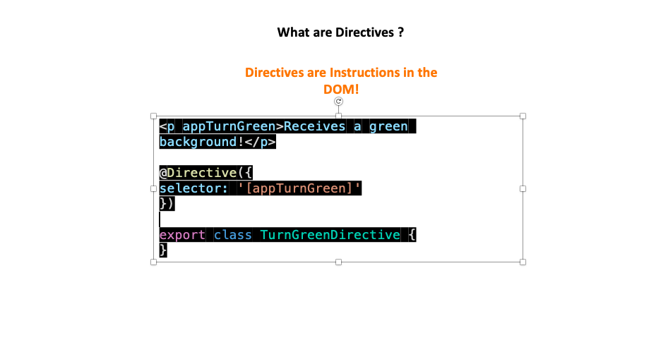

<h1>Angular 9 The Complete Guide</h1>
<p>A JavaScript Framework for creating Reactive Single Page Applications (SPA).</p>

<h3>Features</h3>
<ul>
  <li>TypeScript - A superset of js.</li>
</ul>

<h3>Section 2: The Basics</h3>
<ul>
  <li>Module</li>
  <li>Components</li>
  <li>Databinding</li>
</ul>

<h4>Databinding Explained</h4>


<h4>Property Binding Deep Dive</h4>

<ul>
<li
>Use property binding to set properties of target elements or directive @Input() decorators</li>

<li>You can't use property binding to read or pull values out of target elements. Similarly, you cannot use property binding to call a method on the target element. </li>
</ul>

<h5>Documentation Examples</h5>
<p>The most common property binding sets an element property to a component property value. An example is binding the src property of an image element to a component's itemImageUrl property:</p>

## Example 1

```ts
// assetSnippets/propertyBindingExOne.ts


```

<p>
Here's an example of binding to the colSpan property. Notice that it's not colspan, which is the attribute, spelled with a lowercase s.
</p>

## Example 2
```ts
//assetSnippets/propertyBindingExTwo.ts

<!-- Notice the colSpan property is camel case -->
<tr><td [colSpan]="2">Span 2 columns</td></tr>
```
<p>
Another example is disabling a button when the component says that it isUnchanged:
</p>

## Example 3
```ts
//assetSnippets/propertyBindingExThree.ts

<button [disabled]="isUnchanged">Disabled Button</button>
```
<p>Another is setting a property of a directive:</p>

## Example 4
```ts
//assetSnippets/propertyBindingExFour.ts

<p [ngClass]="classes">[ngClass] binding to the classes property making this blue</p>

```
<p>Yet another is setting the model property of a custom component—a great way for parent and child components to communicate:</p>

## Example 5
```ts
//assetSnippets/propertyBindingExFive.ts

<app-item-detail [childItem]="parentItem"></app-item-detail>
```
<section>
<h2>Bindable Properties and Events</h2>

<p>How do you know to which Properties or Events of HTML Elements you may bind? You can basically bind to all Properties and Events - a good idea is to console.log()  the element you're interested in to see which properties and events it offers.</p>

<strong>Important:</strong> For events, you don't bind to onclick but only to click (=> (click)).

The MDN (Mozilla Developer Network) offers nice lists of all properties and events of the element you're interested in. Googling for YOUR_ELEMENT properties  or YOUR_ELEMENT events  should yield nice results.
</section>

<h3>String Interpolation vs. Property Binding</h3>
<p>You often have a choice between interpolation and property binding. The following binding pairs do the same thing:</p>

## Property Binding vs. Interpolation
```ts
//assetSnippets/propertyBindingVInterpolation.ts

<p> is the <i>interpolated</i> image.</p>
<p> is the <i>property bound</i> image.</p>

<p><span>"{{interpolationTitle}}" is the <i>interpolated</i> title.</span></p>
<p>"<span [innerHTML]="propertyTitle"></span>" is the <i>property bound</i> title.</p>
```
<p>Interpolation is a convenient alternative to property binding in many cases. When rendering data values as strings, there is no technical reason to prefer one form to the other, though readability tends to favor interpolation. However, when setting an element property to a non-string data value, you must use property binding.</p>

<h3>Event binding (event)</h3>
<p>Event binding allows you to listen for certain events such as keystrokes, mouse movements, clicks, and touches.</p>


<p>Angular event binding syntax consists of a <strong>target</strong> event name within parentheses on the left of an equal sign, and a quoted template statement on the right. The following event binding listens for the button's click events, calling the component's onSave() method whenever a click occurs:</p>

<h3>$event and event handling statements</h3>

<p>In an event binding, Angular sets up an event handler for the target event.

When the event is raised, the handler executes the template statement. The template statement typically involves a receiver, which performs an action in response to the event, such as storing a value from the HTML control into a model.

The binding conveys information about the event. This information can include data values such as an event object, string, or number named $event.</p>

<p>The target event determines the shape of the $event object. If the target event is a native DOM element event, then $event is a DOM event object, with properties such as target and target.value.</p>

<p>Consider this example:</p>

## Event handling statements

```ts
//assetSnippets/$eventExample.ts

<input [value]="currentItem.name"
       (input)="currentItem.name=$event.target.value" >
without NgModel
```

<h4>Short notes on Direcives</h4>

