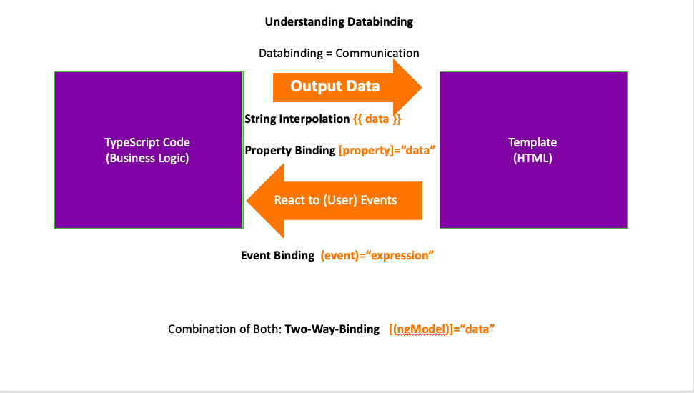

<h1>Learn Angular 8</h1>

A JavaScript Framework for creating Reactive Single Page Applications (SPA).

<h3>Features</h3>
<ul>
  <li>TypeScript - A superset of js.</li>
</ul>

<h3>Section 2: The Basics</h3>
<ul>
  <li>Module</li>
  <li>Components</li>
  <li>Databinding</li>
</ul>

<h4>Databinding Explained</h4>
